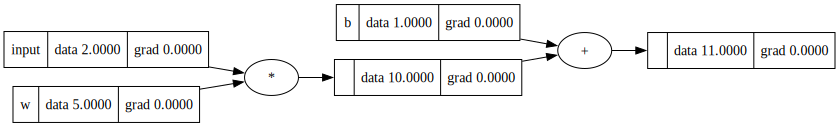
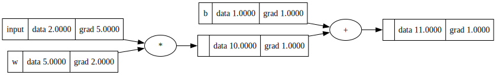

<p align="center">

</p>


LilGradX is a lightweight neural network library built from scratch in Python(Insprired from Andrejs Karpathy's micro grad) . This opensource project is designed to help beginners understand the core principles of neural networks by implementing the fundamental building blocks like tensors with automatic differentiation, neurons, layers, loss functions, and optimizers.


## Why Gradient?

Gradients play a crucial role in helping neural networks learn patterns in data. The gradient represents how much the loss function changes with respect to the model’s parameters (weights and biases). Using this gradient, the model updates its weights with a certain learning rate to minimize the loss. The loss function, such as Mean Squared Error (MSE) or Cross-Entropy, quantifies the difference between the predicted output and the actual output, guiding the optimization processW

[How Gradient Works](https://67e22439f3e3976de807ebc0--grad-mk.netlify.app/)

---
## Upcoming updates in this project:
- Weights and bias initialization using kaiming 
- Bathwise Training
- [Batch Normalization](https://arxiv.org/pdf/1502.03167)
- Changes needed for layer module. 
## Table of Contents
- [About LilGradx](#About)
- [Features](#features)
- [Folder Structure](#folder-structure)
- [Detailed File Descriptions](#detailed-file-descriptions)
  - [Tensor Module (`tensor.py`)](#tensor-module-tensorpy)
  - [Loss Functions (`losses/losses.py`)](#loss-functions-losseslossespy)
  - [Neural Network Components (`ll/`)](#neural-network-components-ll)
  - [Dataset Module (`dataset.py`)](#dataset-module-datasetpy)
  - [Training Script (`train.py`)](#training-script-trainpy)
  - [Testing Script (`test.py`)](#testing-script-testpy)


---

## Folder Structure
LilGradX/ \
│── lilgradx/ \
│   ├── losses/ \
│   │   ├── losses.py \
│   ├── ll/ \
│   │   ├── __init__.py \
│   │   ├── activations.py \
│   │   ├── layer.py \
│   │   ├── loss.py \
│   │   ├── mlp.py \
│   │   ├── neuron.py \
│   │   ├── optimizer.py \
│   ├── __init__.py \
│   ├── dataset.py \
│   ├── tensor.py \
│── mlp_train.py \
│── mlp_test.py \

---

## Detailed File Descriptions

### [Tensor Module (`tensor.py`)](https://github.com/manohark98/LilGradX/blob/main/lilgradx/tensor.py)

Implemented a `Tensor` class that supports automatic differentiation
  to perform gradient in backpropagation during training 

- **Arithmetic Operations:** Overloaded `+`, `*`, `-`, `/`, and power operations.
- **Activation Functions:** Implemented functions like `tanh()`, `exp()`, `log()`, and `leaky_relu()`.
- **Backpropagation:** The `backward()` method performs backpropagation in the computational graph and propagates gradients through it.
  
```python 
  from lilgradx.tensor import Tensor

  a = Tensor(2.0)

  x = Tensor(2.0)
  x.label
  weight = Tensor(5.0)
  bias = Tensor(1.0)

  y = x*weight + bias 

  
```


<p align="center">
  
</p>

After calling the backward() method, it performs gradient with repsective each neuron associate with math operation . 
```python 
  y. backward()
```


<p align="center">
  
</p>


### [Loss Functions (`losses/losses.py`) ](https://github.com/manohark98/LilGradX/blob/main/lilgradx/losses/losses.py)

This module implemented two loss functions:
- **`nll_loss(probs, target_index)`**:  
  Calculates the Negative Log Likelihood loss by taking the log of the softmax probability corresponding to the target class.

```python 
  from lilgradx.losses.losses import nll_loss

  loss = nll_loss(output_probs, target_idx.item())

```


- **`mse_loss(outputs, targets)`**:  
  Computes the Mean Squared Error loss by averaging the squared differences between predictions and targets.

```python 
  from lilgradx.losses.losses import mse_loss

  loss = mse_loss(output_probs, target_idx.item())

```

### Neural Network Components (`ll/`)

This directory contains the core building blocks of your neural network:

- [Activation Function (`ll/activations.py`) ](https://github.com/manohark98/LilGradX/blob/main/lilgradx/ll/activations.py):  
  Defines the `SoftmaxLayer` to normalize the logit outputs of nueral layer  into a probability distribution. It subtracts the maximum logit to bring the  numerical stability.
  ```python 
    from lilgradx.ll.activations import SoftmaxLayer

    self.softmax = SoftmaxLayer()
  ```
  
- [Neural Layer (`ll/layer.py`) ](https://github.com/manohark98/LilGradX/blob/main/lilgradx/ll/layer.py):  
  Implements the `Layer` class, which is essentially a collection of `Neuron` objects. The layer processes an input vector and returns the outputs.
    ```python 
    from lilgradx.ll.layer import Layer

       self.layer = Layer(3,3)
        
    ```
- [Neuron  (`ll/neuron.py`) ](https://github.com/manohark98/LilGradX/blob/main/lilgradx/ll/neuron.py):  

  The `Neuron` class represents a single neuron with randomly initialized weights and bias. It computes the weighted sum of inputs and applies a leaky ReLU activation.
    ```python 

     from lilgradx.ll.neuron import Neuron

       self.layer = Neuron(3)
        
    ```
- [MLP  (`ll/mlp.py`) ](https://github.com/manohark98/LilGradX/blob/main/lilgradx/ll/mlp.py):  
  The `MLP` (Multi-Layer Perceptron) class stacks multiple layers to form a full network. After passing the input through all layers, it applies the softmax activation to produce class probabilities.

    ```python 
    from lilgradx.ll.mlp import MLP

       nin = len(X_train[0])
      nouts = [6, 6, 3]
      mlp = MLP(nin=nin, nouts=nouts)
        
    ```
  
- [Optimizer  (`ll/optimizer.py`) ](https://github.com/manohark98/LilGradX/blob/main/lilgradx/ll/optimizer.py):  
  Implements the Adam optimizer. It updates each parameter using adaptive learning rates based on first and second moment estimates of gradients.
    ```python 
    from lilgradx.ll.optimizer import Adam

    adam_optimizer = Adam(mlp.parameters(), lr=0.01)
        
    ```

### [Dataset Module  (`dataset.py`) ](https://github.com/manohark98/LilGradX/blob/main/lilgradx/dataset.py)

The `Dataset` class handles:
- **Data Loading:** Reads CSV files using Pandas.
- **Data Cleaning:** Drops unwanted columns and missing values.
- **Data Preprocessing:** Converts categorical targets into numerical values, normalizes features, and splits data into training and testing sets using scikit-learn.

    ```python 
    from lilgradx.dataset import Dataset

    dataset = Dataset(file_path="./file", target_column="col_name", drop_columns=['coln_name'])

        
    ```


Note:- Use the following script and customize as per your requirement for training the mlp model.


### [Training Script  ](https://github.com/manohark98/LilGradX/blob/main/mlp_train.py)


The training script performs the following tasks:
1. **Data Preparation:**  
   Loads and preprocesses the data from a CSV file.
2. **Model Initialization:**  
   Constructs an MLP with the given number of input features and output features.
3. **Training Loop:**  
   Iterates over the training data for a set number of epochs, performing forward passes, loss computation (either NLL or MSE), backpropagation, and parameter updates using the Adam optimizer.
4. **Model Saving:**  
   Instead of pickling (which has issues with lambda functions), the script extracts and saves only the numerical values (from the `.data` attribute) along with the network configuration (input size and layer sizes) into a JSON file (`model_state.json`).

### [Testings Script  ](https://github.com/manohark98/LilGradX/blob/main/mlp_test.py)

The testing script is responsible for:
1. **Model Loading:**  
   Trained model parameters will be loaded from json file .
2. **Inference:**  
   Reconstructs the MLP using the saved configuration, assigns the saved parameter values, and uses the model to perform predictions on the test set.
3. **Evaluation:**  
   Computes test accuracy and displays performance metrics, including a confusion matrix and a detailed classification report using scikit-learn.

Note:- While using the above scripts, try to set the same settings of layers in both train and test script
